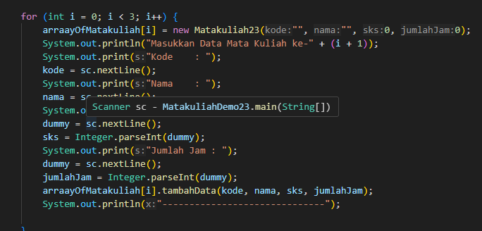
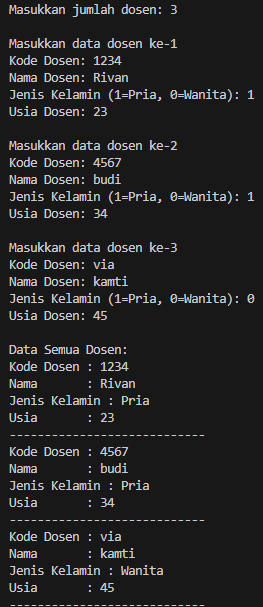

|  | Algoritma dan Struktur Data |
|--|--|
| NIM |  244107020239|
| Nama |  Rivan Fahlul Fadillah |
| Kelas | TI - 1H |
| Repository | [link] (https://github.com/rivan220804/AlgoritmaStrukturData/tree/main/Jobsheet3) |

# JOBSHEET 3

## 3.2 Membuat Array dari Object, Mengisi dan Menampilkan

### 3.2.2 Verifikasi Hasil Percobaan

### 3.2.3 Pertanyaan
Jawaban:
1. Tidak, dikarenakan class bisa hanya memiliki atribut tanpa method aapun sebaliknya mempunyai method tidak memiliki atribut, untuk class array of objects mempunyai atribut untuk menyimpan datanya dan method digunakan untuk metodenya.
2. Mahasiswa[] arrayOfMahasiswa Digunakan untuk mendklarasikan array uang akan menyimpan ojek mahasiswa
new Mahasiswa[3] untuk membuat array berukuran 3 / 3 objek
3. akan diberikan konstruktor default ,jika dengan parameter berarti harus meberikan nilai
4. membuat array 3 objek dari class mahasiswa dan setiap objek diisi dengan nilai data mahasiswa untuk nim,nama,kelas, dan ipk
5. karena untuk membuat kode lebih terstruktur dan muda untuk dipahami

## 3.3 Menerima Input Isian Array Menggunakan Looping

### 3.3.2 Verifikasi Hasil Percobaan

### 3.3.3 Pertanyaan
Jawaban:
1.  kode class Mahasiswa23
    void cetakInfo() {
        System.out.println("NIM   : " + nim);
        System.out.println("Nama  : " + nama);
        System.out.println("Kelas : " + kelas);
        System.out.println("IPK   : " + ipk);
        System.out.println("------------------------------");
    }

    kode class MahasiswaDemo23
    for (int i = 0; i < 3; i++) {
            System.out.println("Data Mahasiswa ke-" + (i+1));
            arrayOfMahasiswa[i].cetakInfo();
    }   

2. karena tidak diinstansiasi yang mana setiap nilainya tidak dapat diakses

## 3.4 Constructor Berparameter

### 3.4.2 Verifikasi Hasil Percobaan

### 3.4.3 Pertanyaan
Jawaban:
1. iya bisa

2. class MataKuliah23

    class MataKuliahDemo23
    

3. class MataKuliah23

    class MataKuliahDemo23
    

4. 

## 3.5 Tugas 
1. hasil kode program

Langkah- angkah kode program
1. pertama melakukan deklarasi variabel.
kode (String) → Kode unik dosen/id
nama (String) → Nama dosen.
jenisKelamin (boolean) → Jenis kelamin dosen (true = laki-laki, false = perempuan).
usia (int) → Usia dosen dalam tahun.
2. Menggunakan konstruktor berparameter
Parameter Constructor:
kode → Untuk menyimpan kode dosen.
nama → Untuk menyimpan nama dosen.
jenisKelamin → Untuk menyimpan jenis kelamin (true = laki-laki, false = perempuan).
usia → Untuk menyimpan usia dosen.
this digunakan untuk membedakan antara variabel instance (this.kode) dan parameter (kode).
3. mengisi data dosen dengan array 
4. Menampilkan semua data dosen 

2. hasil kode program

langkah-langkah kode program
Kode program di atas adalah bagian dari kelas DataDosen23, yang berfungsi untuk mengelola dan menampilkan data dosen dalam bentuk array.
1. dataSemuaDosen23(Dosen23[] arrayOfDosen)

Menampilkan semua data dosen dengan memanggil metode cetakInfo() pada setiap objek Dosen23.

2. jumlahDosenPerJenisKelamin23(Dosen23[] arrayOfDosen)

Menghitung dan menampilkan jumlah dosen berdasarkan jenis kelamin.
Diasumsikan bahwa atribut jenisKelamin bertipe boolean, di mana true berarti pria dan false berarti wanita.

3. rerataUsiaDosenPerJenisKelamin23(Dosen23[] arrayOfDosen)

Menghitung dan menampilkan rata-rata usia dosen berdasarkan jenis kelamin.
Menggunakan variabel akumulatif untuk menghitung total usia dan jumlah dosen pria serta wanita.

4. infoDosenPalingTua23(Dosen23[] arrayOfDosen)

Menentukan dan menampilkan data dosen dengan usia tertua dalam array.

5. infoDosenPalingMuda23(Dosen23[] arrayOfDosen)

Menentukan dan menampilkan data dosen dengan usia termuda dalam array.

Kode ini mengandalkan kelas Dosen23, yang kemungkinan memiliki atribut seperti jenisKelamin dan usia, serta metode cetakInfo() untuk mencetak informasi dosen
