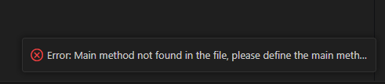
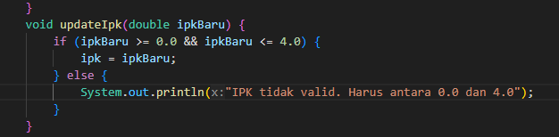
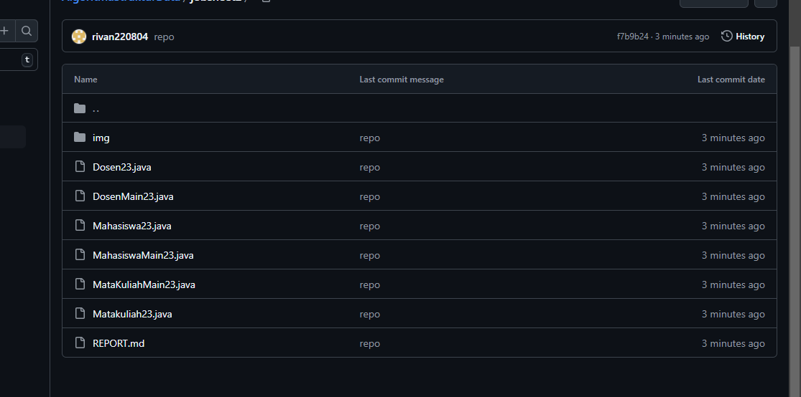
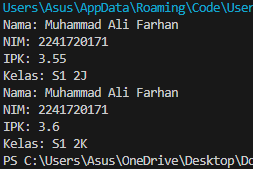
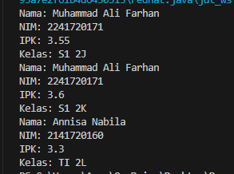
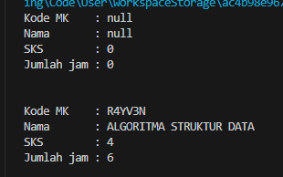
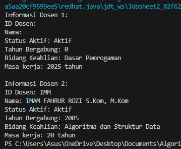

|  | Algoritma dan Struktur Data |
|--|--|
| NIM |  244107020239|
| Nama |  Rivan Fahlul Fadillah |
| Kelas | TI - 1H |
| Repository | [link] (https://github.com/rivan220804/AlgoritmaStrukturData/tree/main/jobsheet2) |

# JOBSHEET 2

## 2.1.1 Percobaan 1

Verifikasi Percobaan

Jawaban :
1. object : Punya atribut,data,Variabel
class : Punya fungsion dan method
2.  4 String nama, String nim, String kelas,double ipk
3.  4 tampilkanInformasi(), ubahKelas(), updateIpk(), nilaiKinerja()
4. Hasil modifikasi

5. method nilaiKinerja() mendapat parameter dari double ipk. Kemudian nilai yang digunakan jika ipknya >= 3.5 maka Kinerja sangat baik, jika ipk 3.0 - 3.49 maka Kinerja baik, ipk 2.0 - 2.99 Kinerja cukup, dan ipk < 2 Kinerja kurang.  mengembalikan nilai berupa string yang menjelaskan method nilai kinerja mahasiswa.
6. Hasil push dan commit ke github

## 2.2.1 Percobaan 2

Verifikasi Percobaan

Jawaban :
1.  Mahasiswa23 mhs1 = new Mahasiswa23() ;
        Mahasiswa23 mhs2 = new Mahasiswa23("Annisa Nabila", "2141720160", 3.25, "TI 2L");
2. Menggunakan operator titik (.) setelah objek.
Contoh:
mhs1.kelas = "TI 1I"; mhs1.tampilkanInformasi();
3. Karena terdapat perubahan nilai pada atribut objek mahasiswa1

## 2.3.1 Percobaan 3

Verifikasi Percobaan

Jawaban :
1. public Mahasiswa23(String nm, String nim, double ipk, String kls) {
            nama = nm;
            this.nim = nim;
            this.ipk = ipk;
            kelas = kls;
        }
2. Membuat objek mahasiswa2 dari class Mahasiswa23 dengan konstruktor berparameter dipanggil untuk mengisi atribut nama, nim, ipk, dan kelas
3. error, karena tidak ada konstruktor yang sesuai
4. tidak selalu berurutan karena bisa yang ingin digunakan saja (efisiensi)
5.  Mahasiswa23 mhs2 = new Mahasiswa23("Annisa Nabila", "2141720160", 3.25, "TI 2L");
        mhs2.tampilkanInformasi();
6. Hasil commit Github

2.4 Latihan Praktikum

1. Hasil kode program latihan praktikum 1 

Penjelasan: 
1. Kelas Matakuliah23 Merepresentasikan data mata kuliah dengan atribut:
kodeMk (kode mata kuliah)
nama (nama mata kuliah)
sks (jumlah SKS)
jumlahJam (jumlah jam per minggu)
2. Method dalam Matakuliah23:
tampilkanInformasi(): Menampilkan detail mata kuliah.
ubahSKS(int sksBaru): Mengubah jumlah SKS.
tambahJam(int jam): Menambah jumlah jam kuliah.
kurangiJam(int jam): Mengurangi jumlah jam dengan pengecekan.
3. Konstruktor:
Default (tanpa parameter).
Berparameter untuk inisialisasi langsung.
4. Kelas MataKuliahMain23
Berisi method main() untuk menjalankan program.
5. Membuat dua objek Matakuliah23:
mk1 (menggunakan konstruktor default).
mk2 (menggunakan konstruktor berparameter).
6. Memanggil method untuk menampilkan, mengubah SKS, serta menambah/mengurangi jumlah jam.

2. Hasil kode program latihan praktikum 2

Penjelasan:
1. Kelas Dosen23
Kelas ini merepresentasikan data seorang dosen dengan atribut:
idDosen: ID unik dosen
nama: Nama lengkap dosen
statusAktif: Status keaktifan dosen (aktif/tidak)
tahunBergabung: Tahun mulai mengajar
bidangKeahlian: Spesialisasi keahlian dosen
2. Method dalam Dosen23:
Konstruktor Default: Menginisialisasi semua atribut dengan nilai default.
Konstruktor Berparameter: Menginisialisasi atribut dengan nilai yang diberikan.
tampilkanInformasi(): Menampilkan detail informasi dosen.
setStatusAktif(boolean status): Mengubah status keaktifan dosen.
hitungMasaKerja(int thnSkrg): Menghitung lama bekerja berdasarkan tahun saat ini.
ubahKeahlian(String bidang): Mengubah bidang keahlian dosen.
3. Kelas DosenMain23
Kelas ini berisi main() untuk menjalankan program.
Objek dosen1 dibuat menggunakan konstruktor default, kemudian status keaktifan dan bidang keahlian diubah secara manual.
Objek dosen2 dibuat menggunakan konstruktor berparameter dengan data lengkap.
4. Memanggil method tampilkanInformasi() dan hitungMasaKerja(2025) untuk menampilkan informasi serta menghitung masa kerja masing-masing dosen.

